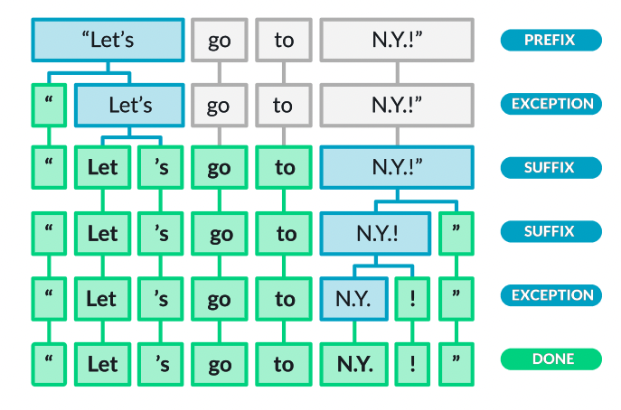

# NLP Guide

A guide on Natural Language Processing (NLP) structured after following the Udemy course [NLP - Natural Language Processing with Python](https://www.udemy.com/course/nlp-natural-language-processing-with-python/) by José Marcial Portilla.

Note that I would have forked the original repository to add notes, but the material is provided with a download link.

This notes file of mine

`NLP_Guide.md`

provides a general guide of the course and points out to the different notebooks of each section:

0. Setup
1. Python Text Basics: `./01_Python_Text_Basics`
2. NLP Basics
3. Part of Speech Tagging & Named Entity Recognition
4. Text Classification
5. Semantics and Sentiment Analysis
6. Topic Modeling
7. Deep Learning for NLP

Mikel Sagardia, 2022.
No guarantees.

## 0. Setup

I installed the following packages/libraries in the environments `ds` and `tf`, which already contained many of the other requirements:

```bash
conda activate ds
conda install keras nltk
conda install -c conda-forge spacy
# Download dictionaries/models
python -m spacy download en # spacy.load('en_core_news_sm')
python -m spacy download es # spacy.load('es_core_news_sm')
python -m spacy download de # spacy.load('de_core_news_sm')
```

However, a YAML with the requirements to create a new conda environment is provided:

`./utils/nlp_course_env.yml`

This is its content:

```yml
name: nlp_course
channels:
  - defaults
dependencies:
  - pip=18.1
  - spacy=2.0.16
  - numpy=1.15.4
  - keras
  - matplotlib=3.0.1
  - pandas=0.23.4
  - nltk=3.3.0
  - scikit-learn=0.20.1
  - jupyter=1.0.0
```

## 1. Python Text Basics: `./01_Python_Text_Basics`

### `01_Text_PDF_Files.ipynb`

This notebook presents the basic python commands to open and handle files and the text in them.

Overview of contents:

1. Working with Text Strings
    - 1.1 f-Strings
    - 1.2 Minimum Widths, Alignment and Padding
    - 1.3 Date Formatting
2. Working with Text Files
    - 2.1 Create a File with Magic Commands
    - 2.2 Opening and Handling Text Files
    - 2.3 Writing to Files
    - 2.4 Appending to a File
    - 2.5 Context Managers
3. Working with PDF Files
    - 3.1 Opening PDFs
    - 3.2 Adding to PDFs
    - 3.3 Example: Extracting Text from PDFs

Summary of the most important commands:

```python

```

### `02_Regular_Expressions.ipynb`

This notebook introduces the basics of regular expression searching; functions, identifiers and examples are presented.

Overview of contents:

1. Basic Search Functions
2. Patterns
    - 2.1 Identifiers & Quantifiers
    - 2.2 Groups
    - 2.3 OR Statements: `|`
    - 2.4 Wildcards: `.`
    - 2.5 Starts with and Ends with: `^,$`
    - 2.6 Exclusion: `[^]`
    - 2.7 Brackets for Grouping (Words): `[]+`
    - 2.8 Parenthesis for Multiple Options
    - 2.9 Example: Find Emails

## 2. Natural Language Processing Basics: `02_Natural_Language_Processing_Basics/`

### `01_Spacy_Basics.ipynb`

The two main NLP libraries we are going to use are **Spacy** and **NLTK**.

Main differences of the two libraries:

- NLTK was released in 2001 and it has several algorithms and models implemented.
- Spacy was released in 2015 and it has the best and fastest methods only; it can be more than 100x faster than NLTK.

Spacy can have a tricky installation: look at [Spacy Installation](https://spacy.io/usage). Take into account that we need to download the dictionaries, too. I installed everything as follows:

```bash
conda install keras nltk
conda install -c conda-forge spacy
# Download dictionaries/models
python -m spacy download en # spacy.load('en_core_news_sm')
python -m spacy download es # spacy.load('es_core_news_sm')
python -m spacy download de # spacy.load('de_core_news_sm')
```

Both libraries are used to perform **Natural Language Processing**, which consists in parsing and structuring the raw text so that it can be handled by the computer.

For a starting guide: [Spacy 101](https://spacy.io/usage/spacy-101).

Overview of contents in the notebook:

1. Model, Doc, Pipeline
2. Tokens and Their Attributes
3. Spans (Slices of Docs) and Sentences

### `02_Tokenization.ipynb`

Tokenization is the process of breaking down the raw text into component pieces or tokens. Tokens have an identified meaning; they are often words, but might be also spaces, punctuation, negation particles, etc. -- because all those have also an identifiable meaning!

A figure from [Spacy: Linguistic Features](https://spacy.io/usage/linguistic-features) gives a good example:



Note that tokenization does not change the text yet, tokens are pieces of the original text, tokenization breaks it down to particles. The splitting occurs when these elements are found:
- White space: ` `
- Prefixes: `" $ (`
- Suffixes: characters at the end: `km ) !`
- Infixes: characters in-between: `/ -`
- Exceptions: tokens are split or prevented from splitting depending on the case: `let's`, `U.S.`

However, punctuation or similar symbols part of email addresses and similar are kept part of the token.

Overview of contents:
1. Tokenization Examples
2. Accessing and Handling Tokens in a `Doc`
3. Named Entities
4. Noun Chunks = Sintagma Nominal
5. Visualizers: Syntatic Dependencies & Entities

### `03_Stemming.ipynb`

Once we have broken down the text into separate tokens, the next step in NLP is **stemming**, which consists in extracting the base form of each token. A word can have many variations; we call **stem** to the original or root form without variations. For example:

`boat -> boats, boating, boater`

Removing final parts to get the stem is not straightforward, since it is full of exceptions; therefore, Spacy does not have a stemmer, but instead, it performs directly **lemmatization**. However, since stemming is a known process in NLP, we're going to try it with [NLTK](https://www.nltk.org/).

Two important stemming algorithms are were ddeveloped by Martin Porter (in 1980):
- Porter Stemmer
- Snowball Stemmer (developed later, based on the first; it improves the speed)

The algorithms use five phases of word reduction, each with its own set of mapping rules.  For instance, in the first phase, easy suffixes are simplified; from all rules in a phase, the one which achieves the largest reduction is applied:

`SSES -> SS:  caresses -> caress`
`IES -> I:    ponies -> poni`

In later phases, more complex mappings are applied, which take more variables into account:

`ATIONAL -> ATE:   relational -> relate; national -> national`

Note that many exceptions arise. Additionally, each language requires its own stemmer.

Overview of contents:
1. Porter Stemmer
2. Snowball Stemmer

### `04_Lemmatization.ipynb`

Beyond shortening the word as when we do stemming, lemmatization tracks the original word with its context to apply morphological analysis; for instance:

- the lemma of `was` is `be`, the lemma of `mice` is `mouse`;
- the lemma of `meeting` can be `meet` (if a verb) or `meeting` (if a noun).

Lemmatization is much more informative and advanced, and that is the reason spacy has only lemmatization and not stemming.

Lemmas can be accessed via `token.lemma_`, nothing additional needs to be done!

### `05_StopWords.ipynb`

**Stop words** are really common words that don't give any additional information; therefore, they are usually removed from the text. Each language has its built-in list; in English, spacy has 326 stop words. Also, we can remove or add words from/to the list; however, the list is not saved when we exit.

### `06_Vocabulary_Matching.ipynb`

This notebook shows how tokens of groups of tokens can be found/matched in a text. It is equivalent to applying regex, but dictionaries are used instead, making the process more powerful and probably less cryptic.

Overview of contents:
1. Rule-Based Matching: like regex to find tokens, but with rules defined using dictionaries and pre-defined keys.
    - 1.1 Pattern Options and Further Keys
2. Phrase Matching: same as before, but applied to group of words (i.e., phrases), not just single tokens.

