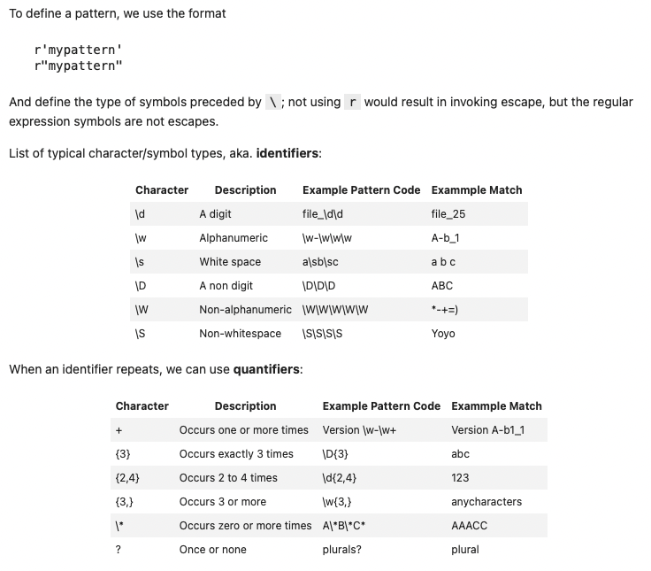

# NLP Guide

A guide on Natural Language Processing (NLP) structured after following the Udemy course [NLP - Natural Language Processing with Python](https://www.udemy.com/course/nlp-natural-language-processing-with-python/) by José Marcial Portilla.

Note that I would have forked the original repository to add notes, but the material is provided with a download link.

This notes file of mine

`NLP_Guide.md`

provide a general guide of the course and points out to the different notebooks of each section:

0. Setup
1. Python Text Basics: `./01_Python_Text_Basics`
2. NLP Basics: `./02_Natural_Language_Processing_Basics`
3. Part of Speech Tagging & Named Entity Recognition: `./03_POS_Tagging_NER`
4. Text Classification: `./04_Text_Classification`
5. Semantics and Sentiment Analysis: `./05_Semantics_Sentiment_Analysis`
6. Topic Modeling: `./06_Topic_Modeling`
7. Deep Learning for NLP

Mikel Sagardia, 2022.
No guarantees.

## 0. Setup

I installed the following packages/libraries in the environments `ds` and `tf`, which already contained many of the other requirements:

```bash
conda activate ds
conda install keras nltk
conda install -c conda-forge spacy
# Download dictionaries/models
python -m spacy download en # spacy.load('en_core_news_sm/trf')
python -m spacy download en_core_web_md # spacy.load('en_core_news_md')
python -m spacy download en_core_web_lg # spacy.load('en_core_news_lg')
python -m spacy download es # spacy.load('es_core_news_sm/trf')
python -m spacy download de # spacy.load('de_core_news_sm/trf')
```

However, a YAML with the requirements to create a new conda environment is provided:

`./utils/nlp_course_env.yml`

This is its content:

```yml
name: nlp_course
channels:
  - defaults
dependencies:
  - pip=18.1
  - spacy=2.0.16
  - numpy=1.15.4
  - keras
  - matplotlib=3.0.1
  - pandas=0.23.4
  - nltk=3.3.0
  - scikit-learn=0.20.1
  - jupyter=1.0.0
```

## 1. Python Text Basics: `./01_Python_Text_Basics`

### 1.1 Working with Text and PDF Files: `01_Text_PDF_Files.ipynb`

This notebook presents the basic python commands to open and handle files and the text in them.

Overview of contents:

1. Working with Text Strings
    - 1.1 f-Strings
    - 1.2 Minimum Widths, Alignment and Padding
    - 1.3 Date Formatting
2. Working with Text Files
    - 2.1 Create a File with Magic Commands
    - 2.2 Opening and Handling Text Files
    - 2.3 Writing to Files
    - 2.4 Appending to a File
    - 2.5 Context Managers
3. Working with PDF Files
    - 3.1 Opening PDFs
    - 3.2 Adding to PDFs
    - 3.3 Example: Extracting Text from PDFs

Summary of the most important commands:

```python
# f-strings
d = {'a':123,'b':456}
print(f"Address: {d['a']} Main Street")

# Tuples which represent table rows
library = [('Author', 'Topic', 'Pages'),
           ('Twain', 'Rafting', 601),
           ('Feynman', 'Physics', 95),
           ('Hamilton', 'Mythology', 144)]

# We print with f-strings, tuple unpacking
# and minimum width using :{width}
# Note that we can pass <, > or ^ between :{ for justification
# and a symbol for filling
for author, topic, pages in library:
    print(f'{author:{10}} {topic:{12}} {pages:.>{12}}')

# Datetime object
from datetime import datetime
today = datetime(year=2018, month=1, day=27)
# We can format datetime as we want using the codes.
# Look at this page to get the codes
# https://strftime.org/
print(f'{today:%B %d, %Y}')

# This creates a text file in Jupyter:
# magic commad %%writefile + filename + contents
%%writefile test.txt
Hello, this is a quick test file.
This is the second line of the file.

# Open the text.txt file we created earlier: it is loaded as a file object
my_file = open('test.txt')

# We can now read the COMPLETE file: the content is returned as a string.
# After that, the reading cursor is at the end, and we can't read anymore.
my_file.read()

# Set cursor to index position 0 = start
# After that, we can read() th complete text again
my_file.seek(0)

# readlines() returns a list of the lines in the file: very practical!
my_file.seek(0)
mylines = my_file.readlines()
for line in mylines:
    print(line)

# Always close the opened files
# otherwise if a file is opened by several processes we could get problems
my_file.close()

# Add a second argument to the function, 'w' which stands for write.
# Passing 'w+' lets us read (+) and write (w) to the file.
# Use TAB to access the docs
# HOWEVER: 'w' removes any content in the file automatically!
my_file = open('test.txt','w+')

# Write to the file
my_file.write('This is a new first line')
my_file.close()

# Passing 'a+' lets us read (+) and append (a) to the file.
# Cursor is set at the end of the file
my_file = open('test.txt','a+')
# We need to addd line breaks manually!
my_file.write('\nThis line is being appended to test.txt')
my_file.write('\nAnd another line here.')
my_file.close()

# Iterating through a file
with open('test.txt','r') as txt:
    for line in txt:
        print(line, end='')  # the end='' argument removes extra linebreaks

# We can use the library PyPDF2 to open PDF files
# however, not all PDF files are always readable.
# To install it: pip install PyPDF2
import PyPDF2

f = open('US_Declaration.pdf','rb')
# List of every page's text.
# The index will correspond to the page number.
pdf_text = [0]  # zero is a placehoder to make page 1 = index 1
# Create PDF reader
pdf_reader = PyPDF2.PdfFileReader(f)
# Extract text page by page
for p in range(pdf_reader.numPages):
    page = pdf_reader.getPage(p)
    pdf_text.append(page.extractText())
# Close file
f.close()

len(pdf_text)
# Print page 1
print(pdf_text[1])

```

### 1.2 Regular Expressions: `02_Regular_Expressions.ipynb`

This notebook introduces the basics of regular expression searching; functions, identifiers and examples are presented.

Overview of contents:

1. Basic Search Functions
2. Patterns
    - 2.1 Identifiers & Quantifiers
    - 2.2 Groups
    - 2.3 OR Statements: `|`
    - 2.4 Wildcards: `.`
    - 2.5 Starts with and Ends with: `^,$`
    - 2.6 Exclusion: `[^]`
    - 2.7 Brackets for Grouping (Words): `[]+`
    - 2.8 Parenthesis for Multiple Options
    - 2.9 Example: Find Emails

**Indentifiers and Quantifiers for Regex**:


Summary of the most important commands:

```python
# Python native library for regular expressions
import re

# Example text
text = "The agent's phone number is 408-555-1234. Call soon!"
pattern = 'phone'

# We always search a pattern in the text
# which returns a match object with a lot of methods & atttributes
match = re.search(pattern,text)

match.span() # (12, 17)
match.start() # 12
match.end() # 17
# Get the found text
# In this case it's trivial, but if we use regular expression patterns
# we don't know the actual found text string
match.group() # 'phone'

# Several match objects
text = "my phone is a new phone"
pattern = 'phone'
for match in re.finditer(pattern,text):
    print(match.span()) # (3, 8), (18, 23)

# To just find the pattern without the return match object
# It makes sense when we use patterns
re.findall(pattern,text) # ['phone', 'phone']

text = "My telephone number is 408-555-1234"
pattern = r'\d\d\d-\d\d\d-\d\d\d\d'
phone = re.search(pattern,text)
# With patterns, we don't really know the content found
# We can access it with group()
phone.group() # '408-555-1234'

# Quantifiers: when an identifier repeats,
# we put its number in curly braces
phone = re.search(r'\d{3}-\d{3}-\d{4}',text)
phone.group() # '408-555-1234'

# We can group pattern parts in () inside their definition
phone_pattern = re.compile(r'(\d{3})-(\d{3})-(\d{4})')
results = re.search(phone_pattern,text)
# The entire result
results.group() # '408-555-1234'
# Can then also call by group position.
# remember groups were separated by parentheses ()
# Something to note is that group ordering starts at 1.
# Passing in 0 returns everything
results.group(1) # '408'

# OR Statements
re.search(r"man|woman","This man was here.")

# Wildcards
re.findall(r".at","The cat in the hat sat here.") # ['cat', 'hat', 'sat']

# One or more non-whitespace that ends with 'at'
re.findall(r'\S+at',"The bat went splat") # ['bat', 'splat']

# Ends with: $
# Ends with a number
re.findall(r'\d$','This ends with a number 2') # ['2']

# Starts with: ^
# Starts with a number
re.findall(r'^\d','1 is the loneliest number.') # ['1']

# Exclusion
# We can use this to remove punctuation from a sentence
test_phrase = 'This is a string! But it has punctuation. How can we remove it?'
re.findall('[^!.? ]+',test_phrase)
clean = ' '.join(re.findall('[^!.? ]+',test_phrase))

# Brackets for Grouping (Words): []+
text = 'Only find the hypen-words in this sentence. But you do not know how long-ish they are'
# We want to find words with a hyphen
# [\w]+: any number of alphanumeric characters
re.findall(r'[\w]+-[\w]+',text) # ['hypen-words', 'long-ish']

# Multiple options
text = 'Hello, would you like some catfish?'
re.search(r'cat(fish|nap|claw)',text)

# Example: Find emails
text = "This is a nice email: name@service.com"
re.findall(r'\w+@\w+.\D{3}',text) # ['name@service.com']

```

## 2. Natural Language Processing Basics: `02_Natural_Language_Processing_Basics/`

### 2.1 Spacy Basics: `01_Spacy_Basics.ipynb`

The two main NLP libraries we are going to use are **Spacy** and **NLTK**.

Main differences of the two libraries:

- NLTK was released in 2001 and it has several algorithms and models implemented.
- Spacy was released in 2015 and it has the best and fastest methods only; it can be more than 100x faster than NLTK.

Spacy can have a tricky installation: look at [Spacy Installation](https://spacy.io/usage). Take into account that we need to download the dictionaries, too. I installed everything as follows:

```bash
conda install keras nltk
conda install -c conda-forge spacy
# Download dictionaries/models
python -m spacy download en # spacy.load('en_core_news_sm')
python -m spacy download es # spacy.load('es_core_news_sm')
python -m spacy download de # spacy.load('de_core_news_sm')
```

Both libraries are used to perform **Natural Language Processing**, which consists in parsing and structuring the raw text so that it can be handled by the computer.

For a starting guide: [Spacy 101](https://spacy.io/usage/spacy-101).

Overview of contents in the notebook:

1. Model, Doc, Pipeline
2. Tokens and Their Attributes
3. Spans (Slices of Docs) and Sentences

Summary of the most important commands (**very important summary**, some lines added from later notebooks):

```python
import spacy
# We load our English _model_
nlp = spacy.load('en_core_web_sm')

# Create a _Doc_ object:
# the nlp model processes the text 
# and saves it structured in the Doc object
# u: Unicode string (any symbol, from any language)
doc = nlp(u'Tesla is looking at buying U.S. startup for $6 million')

# Print each token separately
# Tokens are word representations, unique elements
# Note that spacy does a lot of identification work already
# $ is a symbol, U.S. is handled as a word, etc.
for token in doc:
    # token.text: raw text
    # token.pos_: part of speech: proper noun, verb, ... (MORPHOLOGY)
    # token.dep_: subject, etc., syntactic dependency (SYNTAXIS)
    # token.lemma_: base form of the word
    # token.tag_: detailed part-of-speech tag
    print(token.text, token.pos_, token.dep_)

# The Doc object contains the processed text
# To see how it is processed, we can show the pipeline used
nlp.pipeline

# We can get the basic names of the steps in the pipeline
nlp.pipe_names

# Get first token
doc[0] # Tesla

spacy.explain('PROPN') # 'proper noun'
spacy.explain('nsubj') # 'proper noun'

doc = nlp(u'This is the first sentence. This is another sentence. This is the last sentence.')
w = doc[6]
w.is_sent_start # True

# Access sentences
for sent in doc4.sents:
    print(sent)

# Named Entities
doc = nlp(u'Apple to build a Hong Kong factory for $6 million')
# Named entities can be accessed through .ents
# Named entities are: companies, place names, money amounts, etc.
# Apple, Hong Kong, $6 million
for ent in doc.ents:
    print(ent.text+' - '+ent.label_+' - '+str(spacy.explain(ent.label_)))

# Noun chunks
doc = nlp(u"Autonomous cars shift insurance liability toward manufacturers.")
# Access all noun chunks
for chunk in doc.noun_chunks:
    print(chunk.text) # Autonomous cars, insurance liability, manufacturers

from spacy import displacy
doc = nlp(u'Apple is going to build a U.K. factory for $6 million.')

# Syntactic dependency display of the Doc
displacy.render(doc, style='dep', jupyter=True, options={'distance': 110})

# Entity display
displacy.render(doc, style='ent', jupyter=True)

```

### 2.2 Tokenization: `02_Tokenization.ipynb`

Tokenization is the process of breaking down the raw text into component pieces or tokens. Tokens have an identified meaning; they are often words, but might be also spaces, punctuation, negation particles, etc. -- because all those have also an identifiable meaning!

A figure from [Spacy: Linguistic Features](https://spacy.io/usage/linguistic-features) gives a good example:


Note that tokenization does not change the text yet, tokens are pieces of the original text, tokenization breaks it down to particles. The splitting occurs when these elements are found:
- White space: ` `
- Prefixes: `" $ (`
- Suffixes: characters at the end: `km ) !`
- Infixes: characters in-between: `/ -`
- Exceptions: tokens are split or prevented from splitting depending on the case: `let's`, `U.S.`

However, punctuation or similar symbols part of email addresses and similar are kept part of the token.

Overview of contents:
1. Tokenization Examples
2. Accessing and Handling Tokens in a `Doc`
3. Named Entities
4. Noun Chunks = Sintagma Nominal
5. Visualizers: Syntatic Dependencies & Entities

Summary of the most important commands: Nothing new to add here, since the most important commands are covered in the basics notebook.

### 2.3 Stemming: `03_Stemming.ipynb`

Once we have broken down the text into separate tokens, the next step in NLP is **stemming**, which consists in extracting the base form of each token. A word can have many variations; we call **stem** to the original or root form without variations. For example:

`boat -> boats, boating, boater`

Removing final parts to get the stem is not straightforward, since it is full of exceptions; therefore, Spacy does not have a stemmer, but instead, it performs directly **lemmatization**. However, since stemming is a known process in NLP, we're going to try it with [NLTK](https://www.nltk.org/).

Two important stemming algorithms are were ddeveloped by Martin Porter (in 1980):
- Porter Stemmer
- Snowball Stemmer (developed later, based on the first; it improves the speed)

The algorithms use five phases of word reduction, each with its own set of mapping rules.  For instance, in the first phase, easy suffixes are simplified; from all rules in a phase, the one which achieves the largest reduction is applied:

`SSES -> SS:  caresses -> caress`
`IES -> I:    ponies -> poni`

In later phases, more complex mappings are applied, which take more variables into account:

`ATIONAL -> ATE:   relational -> relate; national -> national`

Note that many exceptions arise. Additionally, each language requires its own stemmer.

Overview of contents:
1. Porter Stemmer
2. Snowball Stemmer

Summary of the most important commands: Look at the notebook; probably, that's not so important, because lemmas from Spacy can be used instead.

### 2.4 Lemmatization: `04_Lemmatization.ipynb`

Beyond shortening the word as when we do stemming, lemmatization tracks the original word with its context to apply morphological analysis; for instance:

- the lemma of `was` is `be`, the lemma of `mice` is `mouse`;
- the lemma of `meeting` can be `meet` (if a verb) or `meeting` (if a noun).

Lemmatization is much more informative and advanced, and that is the reason spacy has only lemmatization and not stemming.

Lemmas can be accessed via `token.lemma_`, nothing additional needs to be done!

Summary of the most important commands: Nothing new here, since the most important commands are in the basics notebook.


### 2.5 Stop Words: `05_StopWords.ipynb`

**Stop words** are really common words that don't give any additional information; therefore, they are usually removed from the text. Each language has its built-in list; in English, spacy has 326 stop words. Also, we can remove or add words from/to the list; however, the list is not saved when we exit.

Summary of the most important commands:

```python
import spacy
nlp = spacy.load('en_core_web_sm')

# Print the set of SpaCy's default stop words (remember that sets are unordered)
print(nlp.Defaults.stop_words)

len(nlp.Defaults.stop_words) # 326

# Check is a word is a stop word
nlp.vocab['myself'].is_stop # False

# Add the word to the set of stop words
# Use lowercase!
nlp.Defaults.stop_words.add('btw')
# Additionally, we need to set the stop_word tag on the lexeme
nlp.vocab['btw'].is_stop = True

# Remove a stop word
nlp.Defaults.stop_words.remove('beyond')
# Remove the stop_word tag from the lexeme
nlp.vocab['beyond'].is_stop = False

```

### 2.6 Vocabulary and Matching: `06_Vocabulary_Matching.ipynb`

This notebook shows how tokens of groups of tokens can be found/matched in a text. It is equivalent to applying regex, but dictionaries are used instead, making the process more powerful and probably less cryptic.

Overview of contents:
1. Rule-Based Matching: like regex to find tokens, but with rules defined using dictionaries and pre-defined keys.
    - 1.1 Pattern Options and Further Keys
2. Phrase Matching: same as before, but applied to group of words (i.e., phrases), not just single tokens.

Summary of the most important commands: Look at the notebook, it is very specific.

## 3. Part-of-Speech (POS) Tagging an Named Entity Recognition (NER): `03_POS_Tagging_NER/`

### 3.1 Part of Speech (POS) Tagging: `01_PartOfSpeech_Tagging.ipynb`

NLP can be significanly improved if the morphological information of the words that compose the text is used. That morphological information is encoded in the *part-of-speech* tags of the tokens, which can be accessed via:

- `token.pos_`: simple morphology, e.g., noun, verb, adjective, etc.
- `token.tag_`: detailed morphology, e.g., plural noun, past-tense verb, superlative adjective, etc.

This notebook summarizes how to access and handle POS tags and collects lists of all possible classes of them.

Overview of contents:

1. Lists of Possibles POS: Simple and Detailed
2. Examples of POS
3. Counting POS & DEP Classes: Frequency Lists
4. Visualizing Parts-of-Speech (POS)

Summary of the most important commands (look also at the basics notebook):

```python
# Counting POS & DEP Classes: Frequency Lists
doc = nlp(u"The quick brown fox jumped over the lazy dog's back.")
# Count the frequencies of different coarse-grained POS tags
# The recipy doc.count_by(spacy.attrs.POS) works for any kind of tag: pos, dep, tag, etc.
POS_counts = doc.count_by(spacy.attrs.POS)
for k,v in sorted(POS_counts.items()):
    print(f'{k}. {doc.vocab[k].text:{5}}: {v}')

# Count the different fine-grained tags
TAG_counts = doc.count_by(spacy.attrs.TAG)
for k,v in sorted(TAG_counts.items()):
    print(f'{k}. {doc.vocab[k].text:{4}}: {v}')

# Count the different dependencies
DEP_counts = doc.count_by(spacy.attrs.DEP)
for k,v in sorted(DEP_counts.items()):
    print(f'{k}. {doc.vocab[k].text:{4}}: {v}')

```

### 3.2 Named Entity Recognition: `02_Named_Entity_Recognition.ipynb`

This notebook deals with the recognition of **named entities**.

Named entities are:
- Person names
- Organizations
- Locations
- Medical codes
- Time expressions
- Quantities
- Monetary values
- Percentages
- ... more examples provided in Section 1.

Spacy recognizes them for us automatically and makes the available via `doc.ents` and `ent.label_` & other properties listed in Section 1.
Additionally, we can easily create our own custom entities.

Overview of contents:

1. List of Named Entity Properties and Label Tags
2. Examples of Named Entities
3. Adding New Entities
    - 3.1 Adding Single Term Entities
    - 3.2 Adding Entities with Several Terms: Phrases
4. Counting Named Entities
5. Visualizing Named Entities

Summary of the most important commands (look also at the basics notebook):

```python
import spacy
nlp = spacy.load('en_core_web_sm')

# Write a function to display basic entity info
def show_ents(doc):
    if doc.ents:
        for ent in doc.ents:
            print(ent.text+' - '+ent.label_+' - '+str(spacy.explain(ent.label_)))
    else:
        print('No named entities found.')

# Adding Single Term Entities
doc = nlp(u'Tesla to build a U.K. factory for $6 million') # Tesla missing
from spacy.tokens import Span
# Get the hash value of the ORG entity label
# Look at the list provided above or in the docs
ORG = doc.vocab.strings[u'ORG']  
# Create a Span for the new entity
# doc - the name of the Doc object
# 0 - the start index position of the span
# 1 - the stop index position (exclusive)
# label=ORG - the label assigned to our entity
new_ent = Span(doc, 0, 1, label=ORG)
# Add the entity to the existing Doc object (we can also use append())
doc.ents = list(doc.ents) + [new_ent]

# Adding Entities with Several Terms: Phrases
# We want to add the two variations or "vacuum cleaner" as PRODUCT entities
doc = nlp(u'Our company plans to introduce a new vacuum cleaner. '
          u'If successful, the vacuum cleaner will be our first product.')
# To that end, we need to match the variations in the Doc
# Import PhraseMatcher and create a matcher object
from spacy.matcher import PhraseMatcher
matcher = PhraseMatcher(nlp.vocab)
# Create the desired phrase patterns
phrase_list = ['vacuum cleaner', 'vacuum-cleaner']
phrase_patterns = [nlp(text) for text in phrase_list]
# Apply the patterns to our matcher object
matcher.add('newproduct', None, *phrase_patterns)
# Apply the matcher to our Doc object
matches = matcher(doc)
# See what matches occur
matches
# Here we create Spans from each match, and create named entities from them
from spacy.tokens import Span
# Create the label (look at the provided list above/docs)
PROD = doc.vocab.strings[u'PRODUCT']
# New entities, created with list comprehension
new_ents = [Span(doc, match[1],match[2],label=PROD) for match in matches]
# Don't forget updating the list of entities (equiv. to append())
doc.ents = list(doc.ents) + new_ents
show_ents(doc)

# Counting Named Entities
doc = nlp(u'Originally priced at $29.50, the sweater was marked down to five dollars.')
len([ent for ent in doc.ents if ent.label_=='MONEY']) # 2

```

### 3.3 Sentence Segmentation: `03_Sentence_Segmentation.ipynb`

Spacy does a great job in segmenting standard sentences separated with `.`. These can be accessed with the generator `doc.sents`, which provides lists of tokens between basedon the flag `token.is_sent_start`.

However, we may want to re-define how sentences are segmented, for instance:
- Cut sentences when `;` appears
- Cut sentences **only** when `\n` or line breaks appear (e.g., in poetry), not under `.`

This notebook presents how to deal with such cases.

Overview of contents:
1. Examples of Sentence Segmentation
2. Adding New Sentence Segmentation Rules
3. Changing Sentence Segmentation Rules (missing section, because code didn't work for my spacy lib version)

Summary of the most important commands: look at the notebook (also the basics notebook/summary).

## 4. Text Classification: `04_Text_Classification/`

### 4.1 Introduction to Scikit Learn and ML Concepts: `00_ScikitLearn_Intro.ipynb`

This notebook is a brief introduction to Machine Learning and Sckit-Learn. We are going to work on the [SMS Spam Dataset @ UCI](https://archive.ics.uci.edu/ml/datasets/SMS+Spam+Collection) as a starter to check the basic ML pipeline with Scikit-Learn. The dataset labels an SMS text as `spam` or `ham`.

We are going to work on the [SMS Spam Dataset @ UCI](https://archive.ics.uci.edu/ml/datasets/SMS+Spam+Collection) as a starter to check the basic ML pipeline with Scikit-Learn. The dataset labels an SMS text as `spam` or `ham`; additionally we have the SMS length and how many punctuation symbols were used. Steps: 

- First, we are going to predict `ham`/`spam` only with the numerical features of `length` and `punct` in the present notebook. However, these values are not enough to predict significantly better than random guesses.
- Then, we're going to extract features from the text in the next notebook.

Overview of contents:

1. ML Concepts - A Refresher: Supervised vs. Unsupervised ML, Performance Metrics of Regression, Performance Metrics of Classification (Accuracy, Precision, Recall, F1, Confusion Matrix).
2. Scikit-Learn Pipeline with SMS Spam Use Case
    - 2.1 Explore the Dataset: Target & Predictors
        - Target: Ham/Spam
        - Predictor 1: Length
        - Predictor 2: Punctuation
    - 2.2 Train/Test Split
    - 2.3 Define, Train & Evaluate Classification Models
        - Logistic Regression: Model Training
        - Logistic Regression: Model Metrics / Evaluation
        - Naive Bayes: Model Training
        - Naive Bayes: Model Metrics / Evaluation
        - Support Vector Machines: Model Training
        - Support Vector Machines: Model Metrics / Evaluation

Notebook: this notebook code is not interesting in the context of NLP; it is a basic introduction to Scikit-Learn and ML. Have a look at the next notebook, it is much more interesting.

### 4.2 Text Feature Extraction: `01_Text_Feature_Extraction.ipynb`

This document explains the basics of text vectorization using TFIDF.

In order to improve the SMS classification or any similar NLP problem, we need to vectorize the text, i.e., convert words/tokens/strings into numerical values. One approach consists in creating a vector which contains an element for every unique/possible word in our texts: that generic vector to be filled in is a **vocabulary**. Each SMS/text is transformed into such a vector, and, in that form, it is considered to be a **bag of words**. With those bags of words, we can

- For each SMS or text document, count the number of times a word/term occurs; that way, we get the **Document Term Matrix**.
- A better alternative consists in weighting the term frequency in each text with the inverse frequency of appearance in all the texts: **TF-IDF, Term Frequency, Inverse Document Frequency**. This approach takes into account the importance of a word in the whole corpus, i.e., the complete text dataset. As such, stop words get a lower weight, thus less importance.

The TFIDF formulas are as follows (although everything is automatically computed):

- $\textrm{tfidf}(t,d,D) = \textrm{tf}(t,d) \cdot \textrm{idf}(t,D)$

- $\textrm{tf}(t,d) = \textrm{count}(t \in d)$: `count (term t in document d)`

- $\textrm{idf}(t,D) = \log \frac{N}{| \{d \in D \, : t \in d \} |}$: `log (total documents N / documents which contain term t)`

Note that the concept of bags of words and the vocabulary can be improved:
- Instead of words, we can used tokens that have been stemmed.
- In addition to counting the stemmed tokens, we can use additional information for each of them: morphological information (`pos_`) and syntactic information (`dep_`). Thus we end up having highly dimensional and sparse hypermatrices (tensors).

Overview of contents:

1. Manual Creation of Bags-of-Words
2. Text Feature Extraction with Scikit-Learn
   - 2.1 Load Dataset and Explore It
   - 2.2 Train/Test Split
   - 2.3 Vectorization
     - 2.3.1 Document Term Matrix: `CountVectorizer`
     - 2.3.2 Term Frequency Inverse Document Frequency: `TfidVectorizer`
   - 2.4 Model: Definition and Training
   - 2.5 Build a Pipeline
   - 2.6 Evaluate the Pipeline/Model
   - 2.7 Inference

Summary of the most important commands (**very important summary**, lines added from next notebook):

```python

### 1. Manual Creation of Bags-of-Words
# This is a vanilla manual creation of vocabularies and bags or words. Not done in practice, since we use scikit-learn functionalities.

text1 = """This is a story about cats
        our feline pets
        Cats are furry animals
        """
text2 = """This story is about surfing
        Catching waves is fun
        Surfing is a popular water sport
        """
texts = [text1, text2]

# Build vocabulary (dictionary)
vocab = {}
i = 1
for text in texts:
    x = text.lower().split()
    for word in x:
        if word in vocab:
            continue
        else:
            vocab[word]=i
            i+=1
print(vocab)

# Extract features
one = ['text1']+[0]*len(vocab)
two = ['text2']+[0]*len(vocab)
bow = [one, two]
i = 0
for text in texts:
    x = text.lower().split()
    for word in x:
        bow[i][vocab[word]] += 1
    i += 1


### 2. Text Feature Extraction with Scikit-Learn

## 2.1 Load Dataset and Explore It

import numpy as np
import pandas as pd
df = pd.read_csv('../data/smsspamcollection.tsv', sep='\t')
df.head()
# Check missing values
df.isnull().sum()
# We need to remove NULL items
df.dropna(inplace=True)
len(df)
# Sometimes empty item texts are filled with spaces
# We need to manually check them in a for-loop
blanks = []  # start with an empty list
for i,lb,tx in df.itertuples():  # iterate over the DataFrame
    if type(tx)==str:            # avoid NaN values
        if tx.isspace():         # test 'review' for whitespace
            blanks.append(i)     # add matching index numbers to the list
print(len(blanks), 'blanks: ', blanks)
# Remove blank entries
df.drop(blanks, inplace=True)
# Final number of items
len(df)
# Check target: balanced? No
df['label'].value_counts()

##  2.2 Train/Test Split

from sklearn.model_selection import train_test_split
X = df['message']  # this time we want to look at the text
y = df['label']
X_train, X_test, y_train, y_test = train_test_split(X, y, test_size=0.33, random_state=42)

##  2.3 Vectorization

##  2.3.1 Document Term Matrix: `CountVectorizer`
from sklearn.feature_extraction.text import CountVectorizer
# Class that creates the Document Term Matrix
count_vect = CountVectorizer()
# Fit the class-object to the training split and transform the split
X_train_counts = count_vect.fit_transform(X_train)
# Vocabulary size: columns (number of features)
X_train_counts.shape

##  2.3.2 Term Frequency Inverse Document Frequency: `TfidVectorizer`
from sklearn.feature_extraction.text import TfidfVectorizer
# Class that created the Document Term Matrix to be filled in with TFIDF values
vectorizer = TfidfVectorizer()
# Fit training split and transform it
X_train_tfidf = vectorizer.fit_transform(X_train) # remember to use the original X_train set
X_train_tfidf.shape

##  2.4 Model: Definition and Training

from sklearn.svm import LinearSVC
clf = LinearSVC() # classifier: clf
clf.fit(X_train_tfidf,y_train)

##  2.5 Build a Pipeline
# Since in NLP all texts need to be pre-processed and vectorized, it is very common to create Pipelines in which we define all transformations required
# Actually, since we need to deploy our application, every ML project should be packed into similar Pipeline objects.
# We can use any classifier here: Support Vector Machines, Naive Bayes, etc.
# When building our Pipeline, we can pass the stop words to the TfidfVectorizer:
# - TfidVectorizer(stop_words='english') to accept scikit-learn's built-in list,
# - or TfidVectorizer(stop_words=[a, and, the]) to accept a custom list.

# List of default stop words in scikit-learn
from sklearn.feature_extraction import text
print(text.ENGLISH_STOP_WORDS)

from sklearn.pipeline import Pipeline
# from sklearn.feature_extraction.text import TfidfVectorizer
# from sklearn.svm import LinearSVC
# from sklearn.naive_bayes import MultinomialNB

text_clf = Pipeline([('tfidf', TfidfVectorizer(stop_words='english')),
                     #('clf', MultinomialNB()),
                     ('clf', LinearSVC()),
])

# Now, we can pass the raw dataset
text_clf.fit(X_train, y_train)  

##  2.6 Evaluate the Pipeline/Model

# Form a prediction set
predictions = text_clf.predict(X_test)
# Report the confusion matrix
# It performs much better than before!
from sklearn import metrics
print(metrics.confusion_matrix(y_test,predictions))
# Print a classification report
print(metrics.classification_report(y_test,predictions))
# Print the overall accuracy
print(metrics.accuracy_score(y_test,predictions))

##  2.7 Inference

# HAM
text_clf.predict(["Hi, how are you doing?"])
# SPAM
text_clf.predict(["Congratulations! You've been selected as a winner. Send a message to 1-800-123-2345."])

```

### 4.3 Text Classification Project: `02_Text_Classification_Project.ipynb`

This notebook shows how to perfom text classification by applying bags-of-words and TFIDF. The [Movie Review Dataset from Cornell](https://www.cs.cornell.edu/people/pabo/movie-review-data/) is used. Nothing new is shown here, just a more complex example than in previous notebook.

Overview of contents:

1. Load and Explore Dataset
2. Train/Test Split
3. Build Pipelines: Naive Bayes & Support Vector Machines with `TfidfVectorizer(stop_words)`
4. Evaluate Pipelines
    - 4.1 Naive Bayes
    - 4.2 Support Vector Machines

This notebook is not that interesting; I have added the most important additions to the previous one:

- Empty text/string detection and removal.
- Stop words in the text vectorizer.
- Pipelines with different classifiers: Naive Bayes, Support Vector Machines.

## 5. Semantics and Sentiment Analysis: `05_Semantics_Sentiment_Analysis/`

### 5.1 Semantics and Word Vectors: `01_Word_Vectors.ipynb`

We are going to use **embedded word vectors** already available in Spacy; but for that, we need to use medium or large language models, which need to be installed explicitly:

```bash
python -m spacy download en_core_web_md # spacy.load('en_core_news_md')
python -m spacy download en_core_web_lg # spacy.load('en_core_news_lg')
```

When we load any of these models, each token has its vector representation. The concept of representing words with vectors was popularized by Mikolov et al. in 2013 (Google) -- see `../literature/Mikolov_Word2Vec_2013.pdf`.

The idea is that we get an `N` dimensional vector representation of each word in the vocabulary, such that:
- **Close vectors are words semantically related**, and associations can be inferred: `man` is to `boy` as `woman` is to `girl`.
- **We can perform vector operations that are reflected in the semantical space**: `vector(queen) ~ vector(king) - vector(man) + vector(woman)`.

In order to generate those word vector embeddings, large corpuses of texts are trained with sets of close words mapping each word to a numerical vector. I understand that in the begining, words are represented as one-hot encoded vectors of dimension `M`, being `M` the size of the vocabulary:

`[0, 1, 0, ..., 0] (M: vocabulary size) -> [0.2, 0.5, ..., 0.1] (N: latent word vector space)`

A common metric to measure similarity between word vectors is the **cosine similarity**: cosine of the angle formed by the two words.

In Spacy, a word vector has dimension `N = 300`; however, not all language models have word vectors!
- `en_core_news_sm` (35MB): no word vector representations
- `en_core_news_md` (116MB): 685k keys, 20k unique vectors (300 dimensions)
- `en_core_news_lg` (812MB): 685k keys, 685k unique vectors (300 dimensions)

Overview of contents:

1. Word Vectors: Token & Doc Vectors
2. Vector Similarity: Cosine Similarity
3. Vector Norms
4. Vector Arithmetic

Summary of most important python commands:

```python

### 1. Word Vectors: Token & Doc Vectors

import numpy as np
import spacy
#nlp = spacy.load('en_core_web_md')  # make sure to use a larger model - it takes longer
nlp = spacy.load('en_core_web_lg')  # make sure to use a larger model - it takes longer

nlp(u'lion').vector.shape # (300,)

# Number of unique vectors loaded in the model
len(nlp.vocab.vectors) # 684830

# Doc and Span objects themselves have vectors,
# derived from the averages of individual token vectors. 
# This makes it possible to compare similarities between whole documents.
doc1 = nlp(u'The quick brown fox jumped over the lazy dogs.')
doc1.vector.shape
v1 = doc1.vector

# According to the documentation, the vector of a Doc is averaged
# without considering the position of each word.
# However, there seems to be some positional encoding, because the vectors are not the same
# Or is it just the numerical error?
#doc = nlp(u'The quick brown jumped fox over the lazy dogs.')
doc2 = nlp(u'The brown quick jumped fox over the lazy dogs.')
v2 = doc.vector
d1=v1-v1
d2=v1-v2
np.sqrt(sum(d1*d1))
np.sqrt(sum(d2*d2))

### 2. Vector Similarity: Cosine Similarity

# Create a three-token Doc object
tokens = nlp(u'lion cat pet')
# Iterate through token combinations
# Note: token1.similarity(token2) == token2.similarity(token1)
for token1 in tokens:
    for token2 in tokens:
        print(token1.text, token2.text, token1.similarity(token2))

# Opposites are not necessarily different!
tokens = nlp(u'like love hate')
# Iterate through token combinations:
for token1 in tokens:
    for token2 in tokens:
        print(token1.text, token2.text, token1.similarity(token2))

### 3. Vector Norms

# Note that usual words, including names, can have vector representations;
# however, in some cases we can come up with a word that has no vector.
tokens = nlp(u'dog cat nargle')
# token.has_vector: True/False
# token.vector_norm: L2 norm or Euclidean length of the vector
# token.is_oov: is out-of-vocabulary, True/False (maybe it is in vocabulary, but has no vector)
for token in tokens:
    print(token.text, token.has_vector, token.vector_norm, token.is_oov)

### 4. Vector Arithmetic

# With word vector embeddings we can perform arithmetics that are reflected in meaningful sematic operations:
# vector(queen) ~ vector(king) - vector(man) + vector(woman)
# However, in my case at least, it does not seem to work that well...

from scipy import spatial

# Our custom similarity function
cosine_similarity = lambda x, y: 1 - spatial.distance.cosine(x, y)

king = nlp.vocab['king'].vector
man = nlp.vocab['man'].vector
woman = nlp.vocab['woman'].vector

# Now we find the closest vector in the vocabulary to the result of
# "king" - "man" + "woman"
new_vector = king - man + woman
computed_similarities = []

# Visit all words/tokens in the vocabulary
# and if they have a valid vector, compute the similarity
for word in nlp.vocab:
    # Ignore words without vectors and mixed-case words
    if word.has_vector:
        if word.is_lower:
            if word.is_alpha:
                similarity = cosine_similarity(new_vector, word.vector)
                computed_similarities.append((word, similarity))

# Sort all similarities by first time, descending
computed_similarities = sorted(computed_similarities, key=lambda item: -item[1])

# Unfortunately, it does not seem to work that well...
print([w[0].text for w in computed_similarities[:10]])

```

### 5.2 Sentiment Analysis with VADER: `02_Sentiment_Analysis.ipynb`

This notebook introduces the problem of **sentiment analysis** and shows how to apply it using the NLTK module [VADER](https://www.nltk.org/_modules/nltk/sentiment/vader.html) = Valence Aware Dictionary for sEntiment Reasoning.

We can apply VADER directly to unlabelled text data to obtain the strength of the sentiment in 3 different directions: positive, neutral and negative; all 3 are also compunded toa 4th value:

```python
{'neg': 0.0, 'neu': 0.425, 'pos': 0.575, 'compound': 0.8877}
```

In the background, VADER maps lexical features to sentiment scores; the sentiment score of a text is the sum of the sentiment score of each word. Note that:
- Negation is understood: `did not love` is the opposite `did love`.
- Exclamation marks, capitals, are taken into account.
- If a text has both positive and negative parts, the result will be the sum, and maybe that is not intended.
- Sarcasm is not captured, e.g., positive words intended as. negative.

Note that the VADER model is already prepared for us! We don't need to have a labelled dataset, nor train anything: we just use it! However, the performance is not as good: 60%-70% accuracy, being 50% a pure random guess. That is probably because we have not trained for the dataset and because human communication is very nuanced -- we can say only in the last sentence what we want, we can be sarcastic, etc.

I think that one could build a regression model for sentiment analysis if we had labelled data (e.g., 5-star ratings); also using TFIDF makes sense.

Overview of contents:
1. NLTK's VADER Module for Sentiment Analysis
2. Example 1: Amazon Reviews Sentiment Analysis with NLTK-VADER
    - 2.1 Load and Clean the Data
    - 2.2 Add Sentiment Scores
    - 2.3 Check Accuracy
3. Example 2: Moview Reviews Sentiment Analysis with NLTK-VADER
    - 3.1 Load and Clean the Data
    - 3.2 Add Sentiment Scores
    - 3.3 Check Accuracy

Summary of the most important python commands:

```python

### 1. NLTK's VADER Module for Sentiment Analysis

import nltk
# Load the VADER lexicon
nltk.download('vader_lexicon')

# Import the library for Sentiment Analysis that makes use of the previos lexicon
from nltk.sentiment.vader import SentimentIntensityAnalyzer
sid = SentimentIntensityAnalyzer()

# VADER's SentimentIntensityAnalyzer() takes in a string
# and returns a dictionary of scores in each of four categories
# - negative
# - neutral
# - positive
# - compound (computed by normalizing the scores above)
a = 'This was a good movie.'
sid.polarity_scores(a) # {'neg': 0.0, 'neu': 0.508, 'pos': 0.492, 'compound': 0.4404}

a = 'This was the best, most awesome movie EVER MADE!!!'
sid.polarity_scores(a) # {'neg': 0.0, 'neu': 0.425, 'pos': 0.575, 'compound': 0.8877}

a = 'This was the worst film to ever disgrace the screen.'
sid.polarity_scores(a) # {'neg': 0.477, 'neu': 0.523, 'pos': 0.0, 'compound': -0.8074}

sid.polarity_scores('best') # {'neg': 0.0, 'neu': 0.0, 'pos': 1.0, 'compound': 0.6369}
sid.polarity_scores('worst') # {'neg': 1.0, 'neu': 0.0, 'pos': 0.0, 'compound': -0.6249}

### 2. Example 1: Amazon Reviews Sentiment Analysis with NLTK-VADER

import numpy as np
import pandas as pd
import nltk
# Load the VADER lexicon
nltk.download('vader_lexicon')
# Import the library for Sentiment Analysis that makes use of the previos lexicon
from nltk.sentiment.vader import SentimentIntensityAnalyzer
sid = SentimentIntensityAnalyzer()

### 2.1 Load and Clean the Data

df = pd.read_csv('../data/amazonreviews.tsv', sep='\t')
df.head()

# Balanced? Quite.
df['label'].value_counts()

# Check if empty reviews
df['review'].isna().sum() + df['review'].isnull().sum()

# Remove if empty reviews
df.dropna(inplace=True)

# Check for empty strings and remove them
blanks = []  # start with an empty list
for i,lb,rv in df.itertuples():  # iterate over the DataFrame
    if type(rv)==str:            # avoid NaN values
        if rv.isspace():         # test 'review' for whitespace
            blanks.append(i)     # add matching index numbers to the list
df.drop(blanks, inplace=True)

# Still Balanced? Same as before: nothing removed
df['label'].value_counts()

### 2.2 Add Sentiment Scores

# Check a single review
sid.polarity_scores(df.loc[0]['review'])
# Label seems to match
df.loc[0]['label']
# Check the review text
df.loc[0]['review']

# Create new column/feature: predicted sentiment score
df['scores'] = df['review'].apply(lambda review: sid.polarity_scores(review))
df.head()

# Take compound value: usually, that's what we take
df['compound']  = df['scores'].apply(lambda score_dict: score_dict['compound'])
df.head()

# Binarize
df['comp_score'] = df['compound'].apply(lambda c: 'pos' if c >=0 else 'neg')
df.head()

### 2.3 Check Accuracy

from sklearn.metrics import accuracy_score,classification_report,confusion_matrix

# It is not a very good metric: random guesses would yield 50%
accuracy_score(df['label'],df['comp_score'])

print(classification_report(df['label'],df['comp_score']))

print(confusion_matrix(df['label'],df['comp_score']))

```

## 6. Topic Modeling: `./06_Topic_Modeling`

